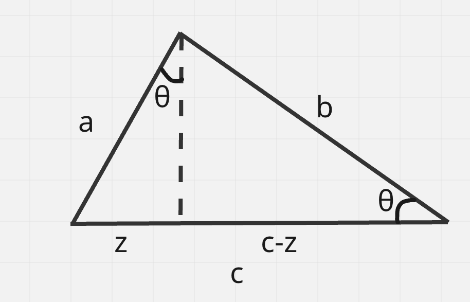
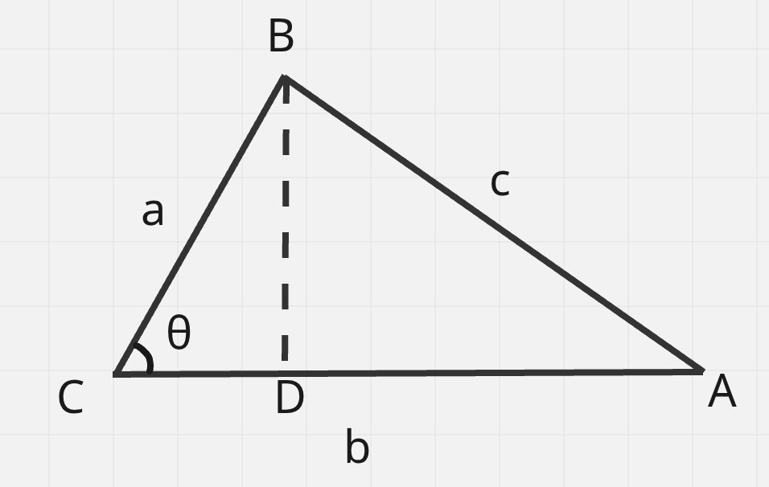

# triangles

> $$\sin(\theta) = \frac{\text{opp}}{\text{hyp}}$$  
> $$\cos(\theta) = \frac{\text{adj}}{\text{hyp}}$$  
> $$\tan(\theta) = \frac{\text{opp}}{\text{adj}}$$  

> $$\text{pythagoras theorem: for a right triangle: } a^2 + b^2 = c^2$$

proof:  

due to similar triangles:  

$$\begin{aligned}
\frac{z}{a} &= \frac{a}{c} \\
a^2 &= zc \\
\frac{b}{c} &= \frac{c-z}{b} \\
b^2 &= c^2 - cz \\
a^2 + b^2 &= c^2 - cz + cz \\
a^2 + b^2 &= c^2 \\
\end{aligned}$$

> $$\text{pythagorean identity: } \sin^2{\theta} + \cos^2{\theta} = 1$$

proof:  

$$\begin{aligned}
\sin^2{\theta} + \cos^2{\theta} &= (\frac{a}{c}) ^2 + (\frac{b}{c}) ^2 \\
\sin^2{\theta} + \cos^2{\theta} &= \frac{a^2 + b^2}{c^2}  \\
\because \text{pythagoras theorem: }a^2 + b^2 &= c^2 \\
\sin^2{\theta} + \cos^2{\theta} &= \frac{c^2}{c^2}  \\
\sin^2{\theta} + \cos^2{\theta} &= 1  \\
\end{aligned}$$

> $$\text{law of cosine: } c^2 = a^2 + b^2 -2ab\cos(\theta)$$
proof:  

$$\begin{aligned}
BD &= \sin(\theta)a \\
CD &= \cos(\theta)a \\
DA &= b - CD \\
DA &= b - \cos(\theta)a \\
DA^2 + BD^2 &= c^2 \\
(b - \cos(\theta)a)^2 + (\sin(\theta)a)^2 &= c^2 \\
b^2 + a^2\cos^2(\theta)-2ab\cos(\theta) + a^2\sin^2(\theta) &= c^2 \\
a^2 (\cos^2(\theta) + \cos^2(\theta)) + b^2 -2ab\cos(\theta) &= c^2 \\
\because \text{pythogorean identity: } \sin^2{\theta} + \cos^2{\theta} &= 1 \\
a^2 + b^2-2ab\cos(\theta) &= c^2
\end{aligned}$$

> $$\text{a vector is a ordered list of numbers scale along each axis. with both magnitude and direction}$$

> $$\text{dot product: } \vec{v_a} \cdot \vec{v_b} = v_{a1}*v_{b1} + ... + v_{an}*v_{bn}$$

> $$\text{magnitude of a vector: } ||\vec{v}|| = \sqrt{\vec{v} \cdot \vec{v}}$$

proof:  
think of it like many applications of the pythogorean theorem. each one collapses scale of two axis into one line. 
2d: $\vec{v} = (x,y) |\vec{v}| = \sqrt{x^2+y^2}$  
3d: $\vec{v} = (x,y,z) |\vec{v}| = \sqrt{\sqrt{x^2+y^2}^2 + z^2} = \sqrt{x^2 + y^2 + z^2}$

> $$\vec{a} \cdot \vec{b} = ||\vec{a}|| * ||\vec{b}|| * \cos(\theta)$$

proof:  

$$\begin{aligned}
\because \text{magnitude of vector definition: }||\vec{v}|| &= \sqrt{\vec{v} \cdot \vec{v}} \\
||\vec{a} - \vec{b}||^2 &= (\vec{a}-\vec{b}) \cdot (\vec{a}-\vec{b})\\
||\vec{a} - \vec{b}||^2 &= \vec{a} \cdot \vec{a} + \vec{b} \cdot \vec{b} - 2\vec{a}\cdot\vec{b}\\
||\vec{a} - \vec{b}||^2 &= ||\vec{a}||^2 + ||\vec{b}||^2 - 2\vec{a}\cdot\vec{b}\\
\because \text{ law of cosine :} c^2 &= a^2 + b^2 -2ab\cos(\theta) \\
||\vec{a} - \vec{b}||^2 &= ||\vec{a}||^2 + ||\vec{b}||^2 - 2||\vec{a}|| * ||\vec{b}|| \cos(\theta) \\
||\vec{a}||^2 + ||\vec{b}||^2 - 2\vec{a}\cdot\vec{b} &= ||\vec{a}||^2 + ||\vec{b}||^2 - 2||\vec{a}|| * ||\vec{b}|| \cos(\theta) \\
-2\vec{a}\cdot\vec{b} &= - 2||\vec{a}|| * ||\vec{b}|| \cos(\theta) \\
\vec{a}\cdot\vec{b} &= ||\vec{a}|| * ||\vec{b}|| \cos(\theta) \\
\end{aligned}$$

